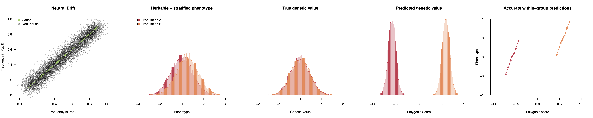

# Analysis of polygenic scores in 1000 Genomes data

## Preliminaries

Raw 1000 Genomes data can be downloaded [here](https://www.cog-genomics.org/plink/2.0/resources).

Population and family GWAS from [Tan et al.](https://www.medrxiv.org/content/10.1101/2024.10.01.24314703v1) can be downloaded from the [SSGAC Repository](https://thessgac.com/papers/16).

PRScs and LD reference data can be installed from [here](https://github.com/getian107/PRScs).

## Analysis code 

`stratification_sim_heritable.R` : R code for simulating and evaluating polygenic scores with population stratification. This code simulated and generates the following figure:

`prscs.sh` : Code to run [PRScs](https://github.com/getian107/PRScs) on a single GWAS study and chromosome.

`merge.sh` : Code to merge polygenic scores across chromosomes into a single genome-wide score.

`score.sh` : Code to run [plink2](https://www.cog-genomics.org/plink/2.0/score) to estimate the score for 1000 Genomes samples.

`1KG.*.csv` : Estimated scores for each 1000 Genomes sample for ADHD and Cognitive Performance.

`plot.R` : Code to produce all visualizations including `Allelic_CogPerf.png`.
